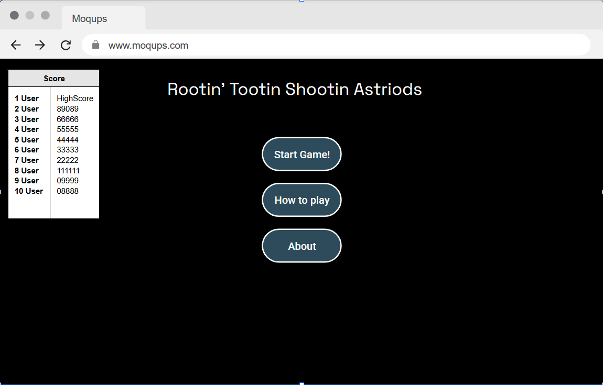

# Web Dev Starter Code

## Project Spec

The theme of this project is being a basic asteroid shooting game. You fly around in a spaceship shooting asteroids. 

The longer you survive and shoot asteroids the higher your score is. The way that I want the website structured is there to be a main menu for the users. There will be a Start game, how to play, and a High Score button. The Start game button will throw you into the game of Rootin Tootin Shootin Asteroids. The How to play button will show you the controls you need to know to play the game. The High Score button will show you the high scores of other players that have played the game. I want the game to show the top 10 scores at the beginning screen and then a separate page will show all user scores.  I also want users to be able to move back and forth between the game and the main menu if they need to. It would be good to also have a game over screen that gives the user options to keep playing or exit to the main menu or record high score. 

The target audience for this game is for people of all ages. People who want a quick 5 or 10 minute break from working on their computer. 

The data that the website will manage are usernames and the high score that they were able to achieve. I want the high scores to be ordered in Highest to Lowest. I also want to limit the user name to 3 or 5 characters. This is so that the user names are not super long. I think the high score will be uncapped but if there are any issues with the high score then I will put a limit on the high score. 

Some stretched goals that I have are that I want to be able to add a space background, a little menu in the game to pause the game if needed.  I could also add an about me page to show people who made the game. I could also maybe have a comment section in the about page in case people have suggestions to other things I could improve on. I could also see if I can add some sort of music in the background of the main menu. I could also try adding sound effects. For example adding sound effects for when you move, shoot, and have a game over. It would also be cool if I could implement a 2 player mode where 2 people can share a keyboard and shoot asteroids together. One could be on the arrow keys while the other is on WASD. It would also be cool to try and either work together to destroy the asteroids or the players shoot each other’s space ships while the asteroids are falling. Adding game modes would be a fun idea if I end up having enough time to implement the other web pages. 

## Project Wireframe

